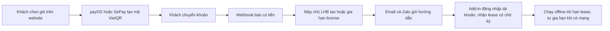
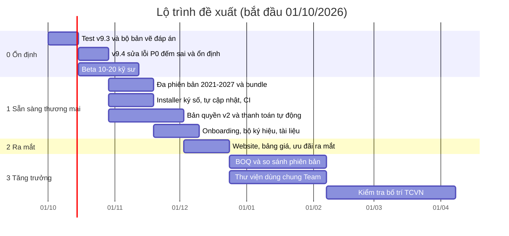

# LHB Block Scheduler — Review chức năng & Kế hoạch thương mại hoá

> **Ngày:** 29/09/2026 · **Phạm vi:** mã nguồn v9.3 Premium (commit `e587fc2`): 53 file C# (~14.100 dòng), `LHB.lsp`, script build/đóng gói, tài liệu, lịch sử GitHub (4 release, 0 issue, 0 PR).
> **Cách làm:** đọc toàn bộ mã, build thử cho 3 nền tảng .NET bằng gói NuGet chính thức của Autodesk, chạy bộ phân tích mã .NET, khảo sát thị trường/đối thủ/giá tại Việt Nam và quốc tế (nguồn ở [mục 12](#12-nguồn-tham-khảo)).
> **Tài liệu này không sửa mã.** Mức ưu tiên: **P0** = bắt buộc trước khi bán · **P1** = nên làm trong 1–2 bản tới · **P2** = cải thiện / mở rộng.

---

## Mục lục

1. [Tóm tắt điều hành](#1-tóm-tắt-điều-hành)
2. [Hiện trạng sản phẩm](#2-hiện-trạng-sản-phẩm)
3. [Review kỹ thuật — các phát hiện](#3-review-kỹ-thuật--các-phát-hiện)
4. [Thị trường & đối thủ](#4-thị-trường--đối-thủ)
5. [Đề xuất tính năng](#5-đề-xuất-tính-năng)
6. [Kế hoạch tối ưu hoá kỹ thuật](#6-kế-hoạch-tối-ưu-hoá-kỹ-thuật)
7. [Mô hình kinh doanh & giá](#7-mô-hình-kinh-doanh--giá)
8. [Lộ trình](#8-lộ-trình)
9. [Rủi ro & cách giảm](#9-rủi-ro--cách-giảm)
10. [Pháp lý & tài chính](#10-pháp-lý--tài-chính)
11. [Việc cần làm ngay](#11-việc-cần-làm-ngay-2-tuần-tới)
12. [Nguồn tham khảo](#12-nguồn-tham-khảo) · [Phụ lục A: build thử](#phụ-lục-a--build-thử-3-nền-tảng) · [Phụ lục B: phân tích mã](#phụ-lục-b--kết-quả-bộ-phân-tích-mã-net)

---

## 1. Tóm tắt điều hành

**Kết luận:** LHB có lõi tốt và nhiều tính năng hơn phần lớn công cụ cùng loại ở Việt Nam (legend có ký hiệu, thư viện block mẫu, tìm trùng bằng hình học, bảng tự cập nhật, theo khu vực, Excel có hình, chiều dài ống/dây, soát lỗi, đánh số, vùng bảo vệ...). Nhưng **chưa sẵn sàng để bán**. Có 5 nút thắt:

| # | Nút thắt | Vì sao quan trọng | Hướng xử lý |
|---|---|---|---|
| 1 | **Chỉ chạy AutoCAD 2021–2024** (DLL `net48`) | AutoCAD 2025/2026 chạy .NET 8 và đã chuyển sang **.NET 10** qua bản cập nhật (2026.1.2 tháng 8/2026, 2025 Update 1.4 tháng 9/2026); AutoCAD 2027 bắt buộc .NET 10; .NET 8 hết hỗ trợ 10/11/2026 | Đã build thử mã hiện tại cho `net48` / `net8.0-windows` / `net10.0-windows` bằng NuGet `AutoCAD.NET` 24.0 / 25.0.1 / 26.0: **0 lỗi, 0 cảnh báo** ([Phụ lục A](#phụ-lục-a--build-thử-3-nền-tảng)). Việc còn lại là đóng gói + test chạy thật |
| 2 | **Cài đặt kiểu máy dev** | Kéo thả `LHB.lsp` dò thư mục Downloads/Desktop; bundle trong repo lại nạp `LHBLoader.dll` (loader chỉ dùng trên máy build) → "Cách 1" trong `HUONG_DAN_SU_DUNG.md` không chạy trên máy khách; DLL chưa ký số | Installer ký số, tự nạp qua ApplicationPlugins, tự cập nhật |
| 3 | **Bản quyền chưa bật và dễ bẻ** | RSA-1024; dùng thử lưu 1 giá trị registry (xoá là dùng lại); mã máy chỉ từ `MachineGuid` (máy cài Ghost trùng nhau); DLL không obfuscate (sửa 1 dòng `Enforced`); cấp mã thủ công | Bản quyền v2: tài khoản online + mã offline, dùng thử trên máy chủ, thanh toán tự cấp mã |
| 4 | **Còn lỗi làm sai số lượng** — điều tối kỵ với sản phẩm "đếm" | Block trong **ARRAY** liên kết bị bỏ qua hoàn toàn; **MINSERT** đếm 1 thay vì hàng × cột; **XREF** bị đếm như block; ảnh ký hiệu cache theo **tên** block dùng chung mọi bản vẽ (Excel ra sai hình); form modeless không theo dõi đóng/đổi bản vẽ (nguy cơ crash) | Bản v9.4 "ổn định" trước khi làm thương mại ([mục 3](#3-review-kỹ-thuật--các-phát-hiện)) |
| 5 | **Chưa có kết quả test thực tế cho v9 → v9.3**, chưa có unit test / CI | 13 tính năng Premium mới chưa được kiểm chứng trên bản vẽ thật | Bộ bản vẽ kiểm thử có "đáp án" + beta 10–20 kỹ sư |

**Thị trường:** "đếm block" cơ bản đã có sẵn trong AutoCAD (COUNT / COUNTTABLE từ 2022, có cả trong AutoCAD LT; Autodesk Assistant 2027.1 còn đếm bằng câu hỏi tự nhiên). LHB không nên bán "đếm", mà bán **kết quả giao nộp**: bảng thống kê / legend có ký hiệu theo **chuẩn công ty**, SL **theo tầng/khu**, **tự cập nhật**, **Excel có hình**, **chiều dài ống/dây**, **soát lỗi**, **kiểm tra bố trí PCCC** — tiếng Việt, chạy cả AutoCAD 2021 (không có COUNT) và sau này ZWCAD/GstarCAD.

**Giá đề xuất:** Free (lõi) → **Pro 890.000đ/năm** hoặc **2.490.000đ vĩnh viễn** → **Team 1.290.000đ/người/năm** (≥ 3 người) → Doanh nghiệp theo báo giá. Tham chiếu: sxCAD 899k–1,2tr/năm (5tr vĩnh viễn), BimSpeed 3–9tr/năm, Dự toán GXD 800k/năm, LISP đếm block 150k/máy.

**Lộ trình:** khoảng 3 tháng tới ngày bán chính thức: Ổn định (4 tuần) → Sẵn sàng thương mại (6–8 tuần) → Ra mắt → Tăng trưởng. Doanh thu năm đầu sau ra mắt (giả định ở [mục 7.7](#77-dự-phóng-doanh-thu--chi-phí-năm-đầu-sau-ra-mắt)): ~90 triệu (thận trọng) / ~410 triệu (cơ sở) / ~1,25 tỷ (lạc quan).

---

## 2. Hiện trạng sản phẩm

### 2.1 Số liệu

| Hạng mục | Giá trị |
|---|---|
| Mã nguồn | 53 file C# (~14.100 dòng: Core ~7.500, UI ~5.550), `LHB.lsp`, `build.ps1`, `PostBuild.ps1` |
| Lệnh | 22 lệnh .NET (`LHBSCAN`, `LHBMAU`, 12 lệnh Premium, 8 lệnh tiện ích/chẩn đoán) + 2 lệnh LISP (`LHBHELP`, `LHBSETPATH`) + phím tắt tự đặt (`LHBLENH`) |
| Phụ thuộc ngoài | Không (JSON, XLSX, Ribbon tự viết bằng thư viện có sẵn) |
| Nền tảng | AutoCAD 2021–2024 x64 (`net48`) |
| Dữ liệu người dùng | `%APPDATA%\LHBBlockScheduler\` (settings.json, Thumbs, CustomImages, log) + `ThuVienMau\*.json/.dwg` cạnh DLL |
| Dữ liệu trong bản vẽ | Khu vực (NOD `LHB_PREMIUM/ZONES`), thông tin cập nhật bảng (Extension Dictionary `LHB_SCAN`), block `LHB_SYM_*`, layer `LHB_*` |
| Phát hành | GitHub Releases v9 → v9.3 (29/09/2026), zip + `HUONG_DAN_TEST_*.md` từng bản |
| Bản quyền | Có hạ tầng (RSA, mã máy, keygen) nhưng đang tắt (`Enforced = false`) |

### 2.2 Bản đồ tính năng

| Nhóm | Tính năng | Lệnh / nơi mở | Module chính | Đã test thực tế? |
|---|---|---|---|---|
| Thống kê lõi | Quét chọn, gom theo tên/chủng loại/layer/thuộc tính, block lồng, quét thêm, tìm kiếm không dấu | `LHBSCAN` | `BlockExtractor`, `BlockScheduleForm` | Có (v1–v8) |
| Thư viện mẫu | Bộ block mẫu (tên thống kê, đơn vị, thứ tự, file .dwg), chỉ quét block mẫu, lấy từ Legend có sẵn | `LHBMAU`, `LHBLEGEND` | `TemplateLibraryManager` | Có (v7–v8) |
| Chất lượng số liệu | Tìm trùng/che lấp, trừ bản thừa, khoanh đỏ, xoá bản thừa | nút Tìm trùng | `DuplicateFinder` | Một phần |
| Xuất bảng | AutoCAD Table có ký hiệu AutoFit đều cỡ, bảng Line+Text, căn lề từng ô | nút Xuất bảng | `TableExporterAcad`, `TableExporter` | v9.2 chưa |
| Premium P1 | SL theo tầng / khu vực | `LHBKHUVUC` | `ZoneManager` | Chưa |
| Premium P2 | Bảng tự cập nhật (ô đổi tô đỏ, thêm dòng mới) | `LHBCAPNHAT` | `TableUpdater` | Chưa |
| Premium P3 | Nhiều bản vẽ (không cần mở) | `LHBNHIEUBV` | `MultiDrawingCounter` | Chưa |
| Premium P4 | Chiều dài ống/dây theo layer, hao hụt, theo khu | `LHBCHIEUDAI` | `LengthCounter` | Chưa |
| Premium P5 | Cột thuộc tính / tham số dynamic, tách dòng | menu Premium | `PremiumColumns` | Chưa |
| Premium P6 | Soát lỗi đếm (explode, khác tên giống hình, layer tắt, lật, tỉ lệ lạ, trùng, ngoài khu) | `LHBSOATLOI` | `CountChecker` | Chưa |
| Premium P7 | Đánh số thiết bị | `LHBDANHSO` | `DeviceNumbering` | Chưa |
| Premium P8 | Vùng bảo vệ PCCC + khoảng hở | `LHBVUNGBV` | `CoverageDrawer` | Chưa |
| Premium P9 | Xuất Excel có ảnh (không cần cài Excel) | nút Xuất Excel | `XlsxWriter`, `ExcelExporter` | Mở thử bằng Excel 16 ngoài CAD |
| Premium P10 | Mẫu bảng (tiêu đề, dòng phụ, dòng tổng, font, màu) | `LHBMAUBANG` | `TableTemplate` | Chưa |
| Premium P11 | Ribbon (qua reflection) + palette | `LHBRIBBON`, `LHBPALETTE` | `RibbonBuilder`, `LhbPalette` | Chưa |
| Premium P12 | Thay block hàng loạt | `LHBTHAYBLOCK` | `BlockReplacer` | Chưa |
| Premium P13 | Bản quyền theo mã máy, dùng thử 30 ngày | `LHBBANQUYEN` | `LicenseManager`, `tools/LHBKeyGen` | Test ngoài CAD |
| Hỗ trợ | Log, chẩn đoán, phiên bản/MD5, phím tắt | `LHBLOG`, `LHBDIAG`, `LHBVERSION`, `LHBLENH` | `Logger`, `Commands` | Có |

---

## 3. Review kỹ thuật — các phát hiện

> Đường dẫn dạng `File.cs:dòng` bấm được trên GitHub. Mọi phát hiện đến từ đọc mã + build (máy review không có AutoCAD); mục ghi "cần kiểm chứng" là chỗ kết quả phụ thuộc cách AutoCAD lưu dữ liệu — xác nhận bằng bản vẽ test trước khi sửa. Khi sửa, thêm log chi tiết đúng chỗ đó (quy tắc trong `CLAUDE.md`).
>
> **Cập nhật 29/09/2026 — v9.4 Premium đã sửa:** A1–A6, B1–B3, C1–C3, D3, D5, E1 (hướng dẫn cài đặt + ghi chú bundle, chưa có installer), E5, `BlockReplacer` O(n²), quét chọn chỉ lấy INSERT. Số dòng trong các liên kết bên dưới là của v9.3. D2 một phần (SeriesMax R24.3, ghi rõ bundle máy dev). Chưa làm: A7, B4 (một phần: highlight bỏ ObjectId bản vẽ khác), C4, C5, D1, D2 (phần còn lại), D4, D6, E2–E4, F1–F6.
>
> **Cập nhật 30/09/2026 — v9.5 Premium (bản quyền v2):** F1 (bật `Enforced` cùng hệ thống mới), F2 (ECDSA P-256), F3 (UUID bo mạch chủ SMBIOS, dự phòng `MachineGuid`), F4 (dùng thử 2 nơi + HMAC + phát hiện lùi đồng hồ; vẫn reset được nếu xoá cả 2 nơi), F6 phần offline (gói tính năng, loại key, serial + thu hồi, nhiều khoá ký, LHBKeyGen v2 + sổ key + GitHub Actions). Chưa làm: F5 (obfuscate, ký số), F6 phần online (máy chủ, thanh toán tự cấp key, khách tự chuyển máy). Chi tiết: [`BAN_QUYEN_VA_CAP_KEY.md`](BAN_QUYEN_VA_CAP_KEY.md).
>
> **Cập nhật 30/09/2026 — v9.7 Premium (AutoCAD 2021 – 2027):** D1 (csproj đa đích `net48` / `net8.0-windows` / `net10.0-windows`, zip có thư mục `net8`, `net10`, `LHB.lsp` chọn DLL theo `ACADVER` và kiểm MD5 từng bản; font WinForms .NET 8 giữ như .NET Framework), D4 (API nội bộ gọi qua hàm riêng, thiếu API chỉ hỏng phím tắt). Chưa làm: D2 (bundle `ApplicationPlugins` phát hành 3 `ComponentEntry` — làm cùng installer E2), D6.

### 3.1 Độ chính xác số lượng (quan trọng nhất)

| # | Mức | Phát hiện | Vị trí | Hậu quả | Đề xuất |
|---|---|---|---|---|---|
| A1 | **P0** | Block nằm trong **ARRAY liên kết** không được đếm: đối tượng array là block ẩn danh `*U...` không phải dynamic → hàm duyệt `return` trước khi đi vào block con | [`BlockExtractor.cs:346`](../Core/BlockExtractor.cs#L346) | Đèn / đầu phun bố trí bằng lệnh ARRAY (mặc định là array liên kết) bị thiếu hoàn toàn trong bảng | Coi block ẩn danh không-dynamic là "vỏ trong suốt": duyệt vào trong, không tăng độ sâu, không đếm chính nó; tuỳ chọn "Đếm trong ARRAY" (mặc định bật); log số array gặp |
| A2 | **P0** | **MINSERT** (`MInsertBlock`) được đếm là 1 dù có nhiều hàng × cột | Không có xử lý `MInsertBlock` trong [`BlockExtractor.cs`](../Core/BlockExtractor.cs) | Thiếu SL ở bản vẽ cũ dùng MINSERT | Nhân `Rows × Columns`, sinh vị trí từng phần tử (cho tìm trùng, khu vực, đánh số) |
| A3 | **P0** | **XREF** được xử lý như block thường: xref thành 1 dòng (nếu không chứa block), block kiến trúc trong xref (cửa, nội thất...) bị đếm khi quét ALL; tên block trong xref có tiền tố `XREF\|` | [`BlockExtractor.cs:340-401`](../Core/BlockExtractor.cs#L340-L401) (không kiểm `IsFromExternalReference`) | Bảng lẫn block rác; block mẫu trong xref không khớp thư viện | Tuỳ chọn "Bỏ qua XREF" (mặc định) / "Đếm cả trong XREF"; bỏ tiền tố `XREF\|` khi khớp block mẫu |
| A4 | P1 | Block con bị **ẩn theo trạng thái visibility** của dynamic block cha vẫn được đếm (duyệt con không kiểm `Visible`) — *cần kiểm chứng* | [`BlockExtractor.cs:209-220`](../Core/BlockExtractor.cs#L209-L220), [`:392-397`](../Core/BlockExtractor.cs#L392-L397); tương tự `TemplateSelectionFilter.ContainsTemplate` | Đếm dư với block cha dynamic có block con khác nhau theo chủng loại | Bỏ entity `!Visible` khi duyệt con (giống `CopyInstanceBtr` đã làm cho ô ký hiệu) |
| A5 | P1 | Độ sâu quét mặc định 2 tầng: block sâu hơn không được đếm, block ở tầng giới hạn có con vẫn bị coi là "lá" | [`BlockExtractor.cs:386`](../Core/BlockExtractor.cs#L386), [`SettingsManager.cs:12`](../Core/SettingsManager.cs#L12) | Thiếu / lẫn SL với cụm block lồng 3 tầng (phòng mẫu → tủ → thiết bị) | Cảnh báo khi chạm giới hạn độ sâu; khi đang dùng bộ block mẫu thì đi sâu không giới hạn và chỉ đếm block mẫu |
| A6 | P1 | Bảng tự cập nhật khớp dòng theo **chỉ số dòng**; vùng quét lưu bằng khung chữ nhật trục X/Y | [`TableUpdater.cs:194-229`](../Core/TableUpdater.cs#L194-L229), [`:291-317`](../Core/TableUpdater.cs#L291-L317) | Chèn/xoá dòng bằng tay → cập nhật ghi nhầm dòng; vùng chọn đa giác/crossing → khung chữ nhật đếm thêm block ngoài vùng cũ | Lưu khoá dòng gắn với từng dòng (cột ẩn / dữ liệu ô), lưu đa giác vùng quét; báo khi cấu trúc bảng đã bị sửa |
| A7 | P2 | Soát khoảng hở vùng bảo vệ chỉ xét "thiết bị gần nhất cách > 2R" | [`CoverageDrawer.cs:56-82`](../Core/CoverageDrawer.cs#L56-L82) | Lưới vuông bước s với R√2 < s ≤ 2R vẫn có vùng không phủ (tâm ô cách s/√2 > R) nhưng không bị báo → cảm giác "đạt" sai | Tính vùng chưa phủ trong đa giác phòng (xem tính năng kiểm tra TCVN, [mục 5](#5-đề-xuất-tính-năng)) |

### 3.2 Ổn định / nguy cơ crash

| # | Mức | Phát hiện | Vị trí | Hậu quả | Đề xuất |
|---|---|---|---|---|---|
| B1 | **P0** | Form thống kê modeless giữ `Document` nhưng không theo dõi `DocumentToBeDestroyed` / đổi bản vẽ. Đóng bản vẽ rồi bấm nút trên form → truy cập Document đã huỷ; sang bản vẽ khác bấm "Xuất bảng" → `GetPoint` trên bản vẽ không active | [`BlockScheduleForm.cs:32`](../UI/BlockScheduleForm.cs#L32), [`:1346-1352`](../UI/BlockScheduleForm.cs#L1346-L1352); các hộp thoại Premium modeless | Nguy cơ crash AutoCAD / lỗi khó hiểu | Tự đóng form khi bản vẽ đóng; chặn thao tác khi `MdiActiveDocument != _doc` ("hãy chuyển về bản vẽ X"); về lâu dài dùng PaletteSet theo bản vẽ hiện hành |
| B2 | **P0** | `BlockExtractor.LastSelectedObjectIds` là biến **static dùng chung mọi bản vẽ** | [`BlockExtractor.cs:52`](../Core/BlockExtractor.cs#L52), dùng ở [`BlockScheduleForm.cs:1000-1009`](../UI/BlockScheduleForm.cs#L1000-L1009), [`BlockScheduleForm.Premium.cs:126`](../UI/BlockScheduleForm.Premium.cs#L126) | Form bản vẽ A đang mở, chạy `LHBSCAN` ở bản vẽ B → đổi tuỳ chọn trên form A quét ObjectId của B (sai hoặc ném lỗi; `TriggerReExtraction` không có try/catch) | Lưu vùng chọn trong từng form; try/catch mọi event handler của form |
| B3 | P1 | Ghi `settings.json` và bộ mẫu bằng `File.WriteAllText` trực tiếp | [`SettingsManager.cs:142-143`](../Core/SettingsManager.cs#L142-L143), [`TemplateLibraryManager.cs:243`](../Core/TemplateLibraryManager.cs#L243) | Crash/mất điện giữa lúc ghi → file hỏng → nạp mặc định, mất phím tắt, mẫu bảng, **mã kích hoạt**; 2 AutoCAD cùng mở ghi đè nhau | Ghi file tạm + `File.Replace` (giữ `.bak`), thêm `SchemaVersion` |
| B4 | P2 | Nhiều trạng thái toàn cục static (highlight, cache, settings) | [`ScheduleManager.cs:18`](../Core/ScheduleManager.cs#L18), [`:135`](../Core/ScheduleManager.cs#L135) | Hành vi lạ khi mở nhiều bản vẽ | Gắn trạng thái theo `Document` (`Document.UserData`) |

### 3.3 Dữ liệu đầu ra

| # | Mức | Phát hiện | Vị trí | Hậu quả | Đề xuất |
|---|---|---|---|---|---|
| C1 | **P0** | Ảnh ký hiệu cache theo **tên block (+ chủng loại)** trong `%APPDATA%\...\Thumbs`, dùng chung mọi bản vẽ, có file là dùng lại | [`ThumbnailGenerator.cs:58-77`](../Core/ThumbnailGenerator.cs#L58-L77), khoá ở [`BlockExtractor.cs:502-517`](../Core/BlockExtractor.cs#L502-L517) | 2 bản vẽ (2 đơn vị thiết kế) có block cùng tên khác hình ("DEN", "SPRINKLER", "O CAM"...) → form và **Excel hiện sai hình**; "Gợi ý gộp" và soát lỗi "khác tên giống hình" dùng hash sai; sửa block (BEDIT) không đổi ảnh. Hiện chỉ có đường vòng `LHBCLEARCACHE` / "Render lại" | Khoá cache = dấu vân tay nội dung định nghĩa block (số entity + extents + handle, hoặc `Database.FingerprintGuid` + handle BTR); trong phiên thì nhớ theo ObjectId |
| C2 | P1 | Ảnh tuỳ chỉnh trong bảng **AutoCAD Table** trỏ thẳng file ở `%APPDATA%\LHBBlockScheduler\CustomImages` (bảng Line+Text thì đã chép ảnh cạnh DWG) | [`TableExporterAcad.cs:1062-1088`](../Core/TableExporterAcad.cs#L1062-L1088) so với [`TableExporter.cs:493-507`](../Core/TableExporter.cs#L493-L507) | Gửi DWG cho người khác → ô ký hiệu mất ảnh | Chép ảnh cạnh DWG như bảng cũ (hoặc chuyển ảnh thành block vector); cảnh báo khi DWG chưa lưu |
| C3 | P1 | Bảng luôn chèn vào **Model Space** (kể cả khi đang ở Layout); `LHBCAPNHAT` chỉ tìm bảng trong Model | [`TableExporterAcad.cs:71`](../Core/TableExporterAcad.cs#L71), [`:271`](../Core/TableExporterAcad.cs#L271), [`TableExporter.cs:74`](../Core/TableExporter.cs#L74), [`TableUpdater.cs:103`](../Core/TableUpdater.cs#L103) | Thói quen đặt bảng thống kê / legend trên khung tên (Layout) không dùng được | Chèn vào `CurrentSpaceId`; `LHBCAPNHAT` duyệt mọi layout; đường dẫn "block trùng" chỉ vẽ khi bảng ở Model |
| C4 | P2 | Zoom / đánh dấu giả định view Top, bỏ qua UCS và view xoay (code có ghi chú) | [`ScheduleManager.cs:221-243`](../Core/ScheduleManager.cs#L221-L243) | Mặt bằng xoay (DVIEW TWIST, UCS riêng) zoom lệch | Đổi WCS → DCS theo view hiện hành |
| C5 | P2 | Excel ghi dòng tổng là số tĩnh, chưa có công thức; chưa có cột đơn giá / thành tiền | [`ExcelExporter.cs:83-91`](../Core/ExcelExporter.cs#L83-L91) | Sửa SL trong Excel thì tổng không đổi | Ghi `=SUM()`; chuẩn bị cho tính năng BOQ ([mục 5](#5-đề-xuất-tính-năng)) |

### 3.4 Tương thích nền tảng

| # | Mức | Phát hiện | Vị trí | Hậu quả | Đề xuất |
|---|---|---|---|---|---|
| D1 | **P0** | Chỉ build `net48` → AutoCAD 2021–2024 | [`LHBBlockScheduler.csproj:4`](../LHBBlockScheduler.csproj#L4) | Mất khách dùng AutoCAD 2025–2027 (máy mới, đại lý bán bản mới) | Multi-target — đã build thử OK ([Phụ lục A](#phụ-lục-a--build-thử-3-nền-tảng)); mỗi DLL 1 `ComponentEntry` trong bundle |
| D2 | **P0** | `PackageContents.xml`: `SeriesMax="R25.1"` nhưng DLL là `net48`; `AppVersion="1.0.0"`, `Author=""`; nạp `LHBLoader.dll` | [`PackageContents.xml`](../Bundle/LHBBlockScheduler.bundle/PackageContents.xml) | Autoloader có thể nạp bản `net48` vào AutoCAD 2025/2026 (không được hỗ trợ) | Khai đúng dải phiên bản cho từng DLL (`R24.0–R24.3` → net48, `R25.0–R25.1` → net8, `R26.0` → net10); cân nhắc `Platform="AutoCAD*"` để nạp cả trong AutoCAD MEP/Electrical — kiểm chứng khi test |
| D3 | P1 | `Process.Start(path)` để mở file Excel: .NET 8/10 mặc định `UseShellExecute = false` | [`ExcelExporter.cs:159`](../Core/ExcelExporter.cs#L159) | Trên AutoCAD 2025+ bấm Xuất Excel xong không tự mở file (chỉ ghi log) | `new ProcessStartInfo(path) { UseShellExecute = true }` (đã làm đúng ở `LHBLOG`) |
| D4 | P1 | Dùng API nội bộ không được hỗ trợ `Autodesk.AutoCAD.Internal.Utils.AddCommand / IsCommandNameInUse` | [`CommandAliasManager.cs:9`](../Core/CommandAliasManager.cs#L9), [`:143`](../Core/CommandAliasManager.cs#L143), [`:225`](../Core/CommandAliasManager.cs#L225) | Có thể đổi / mất ở bản AutoCAD sau | Giữ, nhưng bọc kiểm tra + phương án dự phòng (sinh file LISP alias do add-in quản lý) |
| D5 | P2 | MD5 dùng đặt tên block ký hiệu và kiểm DLL | [`TableExporterAcad.cs:1134`](../Core/TableExporterAcad.cs#L1134), [`Commands.cs:698`](../Commands.cs#L698) | Máy bật chính sách FIPS: `MD5.Create()` ném lỗi → xuất bảng lỗi (hiếm ở VN, có ở tập đoàn) | SHA-256 cắt ngắn cho tên; MD5 chỉ để hiển thị |
| D6 | P2 | Giao diện kích thước pixel cố định, không xử lý DPI; ~1.100 chuỗi tiếng Việt viết cứng | [`BlockScheduleForm.cs:112-113`](../UI/BlockScheduleForm.cs#L112-L113) | Laptop 150% dễ cắt chữ; không bán quốc tế được | `AutoScaleMode.Dpi` + layout co giãn; tách chuỗi ra `.resx` (vi/en) |

### 3.5 Cài đặt & phân phối

| # | Mức | Phát hiện | Vị trí | Hậu quả | Đề xuất |
|---|---|---|---|---|---|
| E1 | **P0** | Bundle nạp `LHBLoader.dll` — loader cho máy build, chỉ tìm DLL trong `%APPDATA%\LHBBlockScheduler\Runtime`. `HUONG_DAN_SU_DUNG.md` mục "Cách 1" còn đường dẫn `C:\Users\vsp\...` và `bin\Debug` | [`PackageContents.xml:17`](../Bundle/LHBBlockScheduler.bundle/PackageContents.xml#L17), [`Loader.cs:83-89`](../Loader.cs#L83-L89), [`HUONG_DAN_SU_DUNG.md`](../HUONG_DAN_SU_DUNG.md) | Khách làm theo "Cách 1" → add-in không chạy | Tách bundle dev / bundle phát hành; installer ([mục 6.3](#63-đóng-gói-cài-đặt-cập-nhật)); sửa hướng dẫn |
| E2 | **P0** | Phân phối bằng kéo thả `LHB.lsp`: LISP dò Downloads/Desktop/Documents (tới 5.000 thư mục) rồi NETLOAD | [`LHB.lsp:105-164`](../LHB.lsp#L105-L164) | Mỗi phiên phải kéo thả (hoặc Startup Suite); cảnh báo SECURELOAD; nhìn không chuyên nghiệp | Installer ký số, cài vào ApplicationPlugins (tự nạp), gỡ cài đặt sạch; giữ `LHB.lsp` cho "bản portable" |
| E3 | P1 | Chưa ký số DLL / installer | — | AutoCAD 2016+ cảnh báo khi nạp DLL chưa ký ngoài thư mục tin cậy; SmartScreen chặn installer | Chứng thư OV/IV code signing (~216–226 USD/năm) |
| E4 | P1 | Chưa có cơ chế cập nhật | — | Khách chạy bản cũ, khó hỗ trợ | Kiểm tra bản mới 1 lần/ngày (manifest JSON / GitHub Releases), nút "Cập nhật" |
| E5 | P2 | Số phiên bản viết cứng ở 4 chỗ | [`AssemblyInfo.cs:12-13`](../Properties/AssemblyInfo.cs#L12-L13), [`:34`](../Properties/AssemblyInfo.cs#L34), [`BlockScheduleForm.cs:111`](../UI/BlockScheduleForm.cs#L111), [`LHB.lsp:30`](../LHB.lsp#L30) | Quên sửa 1 chỗ → báo sai bản | 1 nguồn duy nhất (thẻ git → `Version` MSBuild), UI đọc `AssemblyInformationalVersion` |

### 3.6 Bản quyền & chống bẻ khoá

| # | Mức | Phát hiện | Vị trí | Hậu quả | Đề xuất |
|---|---|---|---|---|---|
| F1 | **P0** | `Enforced = false` → Premium miễn phí (đúng yêu cầu hiện tại) | [`LicenseManager.cs:134`](../Core/LicenseManager.cs#L134) | Chưa thu tiền | Khi bắt bản quyền: bật cùng hệ thống v2, **không** bật lại "trần" hệ thống cũ |
| F2 | **P0** | Khoá RSA **1024 bit** | [`LicenseManager.cs:25-26`](../Core/LicenseManager.cs#L25-L26) | Dưới chuẩn hiện hành (≥ 2048 bit), mã kích hoạt dài | Ed25519 / ECDSA P-256 (chữ ký 64 byte → mã ngắn hơn) |
| F3 | **P0** | Mã máy chỉ từ `MachineGuid` (dự phòng `MachineName\|UserName`) | [`LicenseManager.cs:40-61`](../Core/LicenseManager.cs#L40-L61) | Văn phòng cài Windows bằng Ghost/clone có `MachineGuid` trùng → 1 mã dùng nhiều máy; cài lại Windows đổi mã | Nhiều yếu tố (MachineGuid + serial ổ hệ thống + UUID mainboard/BIOS), khớp 2/3; hoặc kích hoạt online theo tài khoản |
| F4 | **P0** | Dùng thử 30 ngày lưu 1 chuỗi ngày trong `HKCU` | [`LicenseManager.cs:139-159`](../Core/LicenseManager.cs#L139-L159) | Xoá registry / tạo user Windows mới = dùng thử lại; lùi đồng hồ không bị phát hiện | Dùng thử gắn tài khoản trên máy chủ; lưu "ngày thấy lần cuối" có chữ ký để phát hiện lùi giờ |
| F5 | **P0** | DLL .NET không obfuscate, không kiểm tra toàn vẹn | — | dnSpy/ILSpy sửa `IsLicensed` trong vài phút | Obfuscator + ký số + kiểm chữ ký lúc chạy; quan trọng hơn: giá hợp lý, cập nhật thường xuyên, giá trị nằm ở dịch vụ (thư viện đám mây, bộ luật TCVN, hỗ trợ) |
| F6 | P1 | Byte "bản" (edition) trong mã không được kiểm; không thu hồi / chuyển máy; keygen chạy tay | [`LicenseManager.cs:83-93`](../Core/LicenseManager.cs#L83-L93), [`tools/LHBKeyGen`](../tools/LHBKeyGen/Program.cs) | Không phân gói Pro/Team; khách đổi máy phải nhắn người bán; chợ Autodesk yêu cầu dùng được ngay sau khi cài | Máy chủ bản quyền tự cấp mã sau thanh toán, khách tự gỡ/chuyển máy ([mục 6.6](#66-bản-quyền-v2)) |

### 3.7 Chất lượng mã & quy trình

- **Build:** tôi đã build mã hiện tại cho 3 nền tảng (net48 / net8.0-windows / net10.0-windows) **không cần AutoCAD, không cần `libs\`**, dùng gói NuGet chính thức `AutoCAD.NET` với `ExcludeAssets="runtime"` → **0 lỗi, 0 cảnh báo**. Nghĩa là dựng được CI tự động (GitHub Actions) ngay.
- **Phân tích mã .NET (mức Recommended):** 228 cảnh báo, không có lỗi nghiêm trọng; nhiều nhất là định dạng số/chuỗi phụ thuộc vùng (CA1305/1304/1310/1311 ~109), field public (CA1051: 36). Đáng chú ý: MD5 (CA5351, xem D5), `TryParse` bỏ qua kết quả ở [`CoverageDialog.cs:70`](../UI/CoverageDialog.cs#L70), [`NumberingDialog.cs:84`](../UI/NumberingDialog.cs#L84). Chi tiết: [Phụ lục B](#phụ-lục-b--kết-quả-bộ-phân-tích-mã-net).
- **Chưa có unit test, chưa có CI.** Build + đóng gói chỉ chạy trên máy dev (cần `libs\*.dll`, đường dẫn `C:\Program Files\dotnet`, PowerShell).
- **File lớn khó bảo trì:** `BlockScheduleForm.cs` 1.607 dòng, `TableExporterAcad.cs` 1.141 dòng → tách theo chức năng (Presenter / dịch vụ xuất bảng / dịch vụ ký hiệu).
- Các `catch {}` rỗng (~30) phần lớn có chủ đích (dọn dẹp / thăm dò) — chấp nhận được.

### 3.8 Hiệu năng

v9.1 đã tối ưu tốt (`SuppressRegenerateTable`, cache khung bao / block con theo BTR, lọc `ObjectClass` trước khi mở, ảnh trong bộ nhớ). Điểm còn lại:

| Điểm nóng | Vị trí | Đề xuất |
|---|---|---|
| Xoá dấu (trùng, soát lỗi, đánh số, vùng bảo vệ) mở **từng entity** trong Model Space để xem layer | [`DuplicateFinder.cs:408-420`](../Core/DuplicateFinder.cs#L408-L420), [`DrawingHelper.cs:35-55`](../Core/DrawingHelper.cs#L35-L55) | `Editor.SelectAll` + lọc layer, hoặc lưu handle dấu trong NOD |
| Quét chọn không lọc `INSERT` ngay lúc chọn → chọn ALL trả hàng trăm nghìn ObjectId | [`BlockExtractor.cs:109`](../Core/BlockExtractor.cs#L109) | Thêm `SelectionFilter` (DXF 0 = INSERT) khi không dùng lọc block mẫu |
| `BlockReplacer` dùng `List.Contains` trong vòng lặp → O(n²) | [`BlockReplacer.cs:115`](../Core/BlockReplacer.cs#L115) | `HashSet<ObjectId>` |
| Soát khoảng hở O(n²) mỗi loại thiết bị | [`CoverageDrawer.cs:59-69`](../Core/CoverageDrawer.cs#L59-L69) | Lưới không gian khi > 2.000 thiết bị |
| Nhiều bản vẽ chạy tuần tự trên luồng chính, không huỷ được | [`MultiDrawingCounter.cs:46-107`](../Core/MultiDrawingCounter.cs#L46-L107) | Nút Huỷ + tiến trình; chạy hàng loạt bằng AutoCAD Core Console |

### 3.9 Điểm làm tốt (nên giữ)

- Kỷ luật `Transaction` / `LockDocument`, không gọi API AutoCAD từ luồng khác.
- `ExtentsHelper` bền với block lỗi extents (ĐÈN EXIT); log chi tiết + `LHBDIAG` giúp hỗ trợ từ xa hiệu quả.
- Không phụ thuộc thư viện ngoài (JSON, XLSX tự viết) → không xung đột DLL trong `acad.exe`.
- Tìm trùng có hình học chuẩn (Sutherland–Hodgman, union-find, quét theo trục X); gom dòng linh hoạt (chủng loại / layer / thuộc tính).
- Dữ liệu Premium đi theo bản vẽ (NOD, Extension Dictionary, lưu handle — không lưu ObjectId).
- Giao diện tiếng Việt, tìm kiếm không dấu, phím tắt tuỳ biến, hướng dẫn test từng bản kèm MD5.

---

## 4. Thị trường & đối thủ

### 4.1 AutoCAD đã có sẵn gì

| Tính năng | Có từ | Ghi chú |
|---|---|---|
| `COUNT`, Count palette, `COUNTTABLE`, `COUNTFIELD` | AutoCAD & AutoCAD LT 2022 | Đếm theo tiêu chí (thuộc tính, tham số dynamic), gồm block lồng; báo lỗi chồng lấp / explode / đổi tên; `COUNTTABLE` chèn bảng tên block + số lượng |
| Chọn vùng đếm (chữ nhật, đa giác, đối tượng) | 2023 | |
| Sửa lỗi bỏ sót block ở mép vùng đếm | 2027.1 | |
| Autodesk Assistant: hỏi số lượng block bằng câu tự nhiên | 2027.1 | |
| `DATAEXTRACTION` | lâu đời | Xuất thuộc tính ra bảng / Excel (không có hình) |

**Hàm ý:** không cạnh tranh ở "đếm". Cạnh tranh ở sản phẩm giao nộp theo thói quen Việt Nam và ở nhóm khách không có COUNT (AutoCAD 2021, ZWCAD/GstarCAD).

| Tiêu chí | AutoCAD COUNT | LHB |
|---|---|---|
| Tên thiết bị / đơn vị / chủng loại tiếng Việt | Tên block | Có (thư viện block mẫu, chuẩn công ty) |
| Cột ký hiệu (hình block) trong bảng | Không (tên + SL) | Có, đều cỡ, co giãn theo ô |
| SL theo tầng / khu trong 1 bảng | Không | Có |
| Excel có hình | Không | Có |
| Chiều dài ống / dây, đánh số, vùng bảo vệ | Không | Có |
| Nhiều bản vẽ | Không (dùng Data Extraction) | Có |
| AutoCAD 2021 / ZWCAD / GstarCAD | Không | 2021 có; ZWCAD/GstarCAD dự kiến |
| Giá | Kèm AutoCAD | Trả phí |

### 4.2 Chợ ứng dụng Autodesk (Design & Make Marketplace)

- Năm 2026 Autodesk thay App Store bằng **Design & Make Marketplace**. Thoả thuận nhà phát hành (cập nhật 03/05/2026): **hoa hồng hiện là 0%** trên phí thực nhận (FAQ cũ nói có thể tới 30% trong tương lai); thanh toán qua đơn vị xử lý thanh toán do Autodesk chỉ định (PayPal / BlueSnap); nhà phát hành tự chịu thuế, hoàn tiền và **tự lo bản quyền**.
- Sản phẩm phải **dùng được ngay sau khi cài**; nếu cấp mã thủ công thì phải có thời gian ân hạn. Autodesk có **Entitlement API** (dựa trên biến `ONLINEUSERID`) để kiểm tra người đã mua.
- Trên chợ đã có nhiều app đếm miễn phí (vd *comsCountIt!* — nhiều bản vẽ, xuất Excel; *CountBlocks*). → Chỉ nên lên chợ khi có **tiếng Anh** và điểm khác biệt rõ (legend có ký hiệu, theo khu, kiểm tra bố trí). Khách quốc tế là khách dùng AutoCAD bản quyền → trả tiền dễ hơn.

### 4.3 Thị trường Việt Nam

| Sản phẩm | Loại | Giá công bố | Mô hình |
|---|---|---|---|
| LISP chia sẻ trên CADViet, blog... | LISP đếm block, có/không hình | 0đ | Miễn phí |
| QC Thống kê nhanh (lisp.vn) | LISP đếm block, định vị, xuất Excel | 150.000đ/máy | Vĩnh viễn, khoá phần cứng |
| sxCAD | Add-in AutoCAD (shop, bóc khối lượng kết cấu) | 899k–1,2tr/năm; 5tr vĩnh viễn/máy; USB 4,999tr | Tài khoản online / khoá máy / USB; hỗ trợ AutoCAD 2015–2026 |
| BimSpeed | Add-in Revit | 3tr / 6tr / 9tr mỗi năm (KT hoặc KC / KT+KC / +MEP) | Tài khoản online, có dùng thử |
| Dự toán GXD | Phần mềm dự toán | 800k/năm (khoá mềm); 4tr khoá cứng | |
| AutoCAD chính hãng | | ~38,99tr/năm (LT ~10,89tr/năm) | Thuê bao |
| ZWCAD / GstarCAD | CAD thay thế, bản quyền vĩnh viễn | ZWCAD ~1.100–1.499 USD | Được nhiều DN (FDI, thép tiền chế...) dùng để tuân thủ bản quyền |

**Nhận xét giá:** khách cá nhân quen mức 150k–1tr; doanh nghiệp chấp nhận 3–9tr/người/năm cho công cụ tiết kiệm thời gian rõ ràng (BimSpeed). Nhu cầu tìm kiếm "lisp thống kê block", "thống kê thiết bị PCCC", "bảng thống kê vật tư" là có thật (nhiều bài / video chia sẻ LISP) → kênh nội dung (SEO, YouTube) phù hợp.

### 4.4 Nguồn mở / GitHub đáng tham khảo

| Nguồn | Dùng để làm gì cho LHB |
|---|---|
| Lee Mac: *Block Counter*, *Dynamic Block Counter*, *Nested Block Counter*, *Count Attribute Values* | Ý tưởng đếm theo giá trị thuộc tính có wildcard tag, bảng MTO |
| Kean Walmsley — *Creating a legend of AutoCAD drawings using .NET* | Mẫu legend có ô block trong Table |
| `ADN-DevTech/EntitlementAPI`, `MadhukarMoogala/EntitlementAPIForACAD` | Mẫu kiểm tra người mua trên chợ Autodesk |
| `DomCR/ACadSharp` (MIT) | Đọc DWG/DXF **không cần AutoCAD** → hướng "LHB Web" (đếm trên trình duyệt / máy chủ), công cụ kiểm thử |
| `nanoLogika/ACadSvg` | Xuất hình block ra SVG cho web / catalog ký hiệu |
| `luanshixia/AutoCADCodePack` | Thư viện tiện ích AutoCAD .NET |
| Gói NuGet `AutoCAD.NET` (24.0 → 26.0) | Build không cần cài AutoCAD (đã kiểm chứng) |
| Autodesk Automation API for AutoCAD (engine 2027, .NET 10) | Chạy plugin trên đám mây cho bản SaaS về sau |

### 4.5 SWOT

| Điểm mạnh | Điểm yếu |
|---|---|
| Đúng nghiệp vụ PCCC/M&E Việt Nam; legend có ký hiệu đều cỡ; thư viện mẫu; tìm trùng hình học; nhiều tính năng Premium; không phụ thuộc thư viện ngoài; chẩn đoán từ xa tốt | Chỉ AutoCAD 2021–2024; cài đặt thủ công; bản quyền yếu; chưa test v9+; 1 người phát triển; chỉ tiếng Việt |
| **Cơ hội** | **Thách thức** |
| Khách chuyển lên AutoCAD 2025–2027 cần công cụ chạy được bản mới; DN dùng ZWCAD/GstarCAD (bản quyền) cần công cụ tương đương; BOQ/phát sinh khối lượng; tiêu chuẩn PCCC mới (TCVN 5738:2021, 7336:2021, 13456:2022, QCVN 06:2022/BXD); thanh toán VietQR tự động miễn phí | AutoCAD COUNT/Assistant ngày càng mạnh; LISP miễn phí; tỉ lệ dùng phần mềm lậu cao → bẻ khoá; Autodesk đổi nền .NET giữa kỳ (đã xảy ra năm 2026) |

---

## 5. Đề xuất tính năng

Công sức: **S** ≤ 1 tuần · **M** 2–4 tuần · **L** > 1 tháng (1 người + Claude Code).

### 5.1 Hoàn thiện sản phẩm — bắt buộc trước khi bán

| # | Tính năng | Giá trị cho khách | Công sức | Gói |
|---|---|---|---|---|
| 1 | Đếm đúng ARRAY / MINSERT / XREF / visibility (A1–A5) + báo cáo "đã bỏ qua gì" | Tin được con số | S–M | Free |
| 2 | Bảng / legend chèn vào Layout hiện hành; `LHBCAPNHAT` mọi layout (C3) | Đúng thói quen khung tên | S | Free / Pro |
| 3 | Ảnh ký hiệu theo nội dung block (C1), ảnh tuỳ chỉnh đi theo DWG (C2) | Không sai hình, gửi bản vẽ không mất ảnh | S | Free |
| 4 | Form an toàn khi đổi / đóng bản vẽ (B1–B2), lưu cài đặt an toàn (B3) | Không crash, không mất cài đặt | S | — |
| 5 | Chạy AutoCAD 2021–2027 (D1–D3) | Không mất khách bản mới | M | — |
| 6 | Installer ký số, tự nạp, tự cập nhật, gỡ sạch (E1–E5) | Cài 1 lần, không kéo thả | M | — |
| 7 | Bản quyền v2 + thanh toán tự cấp mã (F1–F6) | Mua xong dùng ngay | M–L | — |
| 8 | Trình hướng dẫn lần đầu: chọn bộ ký hiệu (PCCC / Điện / ELV / Cấp thoát nước), tỉ lệ, mẫu bảng → ra bảng đầu tiên < 5 phút | Giảm bỏ cuộc lần đầu | S | Free |
| 9 | **Bộ ký hiệu dựng sẵn** theo chuyên ngành, tên thống kê chuẩn (dùng thư viện block mẫu có sẵn) | Dùng ngay không cần tự tạo thư viện; lý do để tải bản Free | M (nội dung) | Free (bộ cơ bản) / Pro (bộ đầy đủ) |

### 5.2 Gói Pro — tạo khác biệt để thu tiền

| # | Tính năng | Giá trị cho khách | Công sức |
|---|---|---|---|
| 10 | **Xuất BOQ / dự toán**: gán mã vật tư / mã hiệu định mức + đơn giá cho từng loại thiết bị (lưu trong bộ mẫu) → Excel "Bảng khối lượng – dự toán" (Thành tiền = SL × Đơn giá, tổng theo tầng, dùng công thức), cột theo mẫu để nhập vào phần mềm dự toán | QS/nhà thầu tiết kiệm nhiều giờ mỗi hồ sơ → lý do trả tiền mạnh nhất | M |
| 11 | **So sánh phiên bản** (khối lượng phát sinh): lưu "ảnh chụp" thống kê trong bản vẽ; lần sau so → bảng tăng/giảm theo thiết bị & tầng, khoanh vị trí thêm/bớt | Làm hồ sơ phát sinh, kiểm tra sửa đổi | M |
| 12 | **Kiểm tra bố trí theo TCVN** (bộ luật cấu hình được): đầu báo (TCVN 5738:2021), sprinkler (TCVN 7336:2021), đèn sự cố / chỉ dẫn thoát nạn (TCVN 13456:2022) — khoảng cách tối đa giữa thiết bị, tới tường, diện tích bảo vệ; tô vùng chưa phủ trong phòng; báo cáo PDF/Excel | Giảm lỗi khi thẩm duyệt PCCC; khác biệt hẳn COUNT | L |
| 13 | Thống kê theo **Layout / Viewport**: mỗi layout (tầng) 1 cột, không cần vẽ đường bao | Nhanh hơn khai báo khu vực | M |
| 14 | Chiều dài dây / ống nâng cao: cộng đoạn lên xuống theo thiết bị (vd +3 m/đầu báo), dự phòng theo layer, tách theo mạch (thuộc tính / layer), gộp vào BOQ | BOQ cáp sát thực tế | S–M |
| 15 | Legend chuyên nghiệp: chỉ ký hiệu + tên (không SL), nhiều cột, tự chia theo khung tên, song ngữ Việt–Anh | Dùng cho bản vẽ thi công, dự án nước ngoài | S–M |
| 16 | Đếm theo giá trị thuộc tính kiểu Lee Mac (wildcard tag); sửa tên / đơn vị trên bảng → ghi ngược vào bộ mẫu | Chuẩn hoá nhanh | M |
| 17 | Xuất PDF báo cáo thống kê (có hình) | Gửi chủ đầu tư / QS | S |

### 5.3 Gói Team / Doanh nghiệp

| # | Tính năng | Giá trị | Công sức |
|---|---|---|---|
| 18 | **Thư viện mẫu dùng chung**: thư mục mạng / OneDrive / Google Drive hoặc đám mây LHB, có phiên bản, admin phát hành chuẩn công ty, máy thành viên tự đồng bộ | Cả công ty dùng 1 chuẩn ký hiệu, tên, đơn vị | M–L |
| 19 | Quản trị bản quyền tập trung (thêm / bớt người, chuyển máy), xuất hoá đơn | DN mua nhiều suất | M |
| 20 | Chạy hàng loạt bằng **AutoCAD Core Console** (không mở giao diện) cho cả dự án → Excel tổng hợp | Thống kê hàng trăm bản vẽ qua đêm | M |
| 21 | Dịch vụ cấu hình mẫu bảng / legend / BOQ theo chuẩn công ty, đào tạo | Doanh thu dịch vụ, giữ chân khách | Dịch vụ |

### 5.4 Mở rộng thị trường (năm 2)

| # | Hướng | Ghi chú | Công sức |
|---|---|---|---|
| 22 | **ZWCAD / GstarCAD** (sau đó BricsCAD) | API .NET gần giống AutoCAD (khác namespace: `ZwSoft.ZwCAD.*`, `GrxCAD.*`); cần lớp trung gian ([mục 6.1](#61-kiến-trúc-mục-tiêu)); phần khác biệt: ô block trong Table, render ảnh off-screen | M–L mỗi nền tảng |
| 23 | Giao diện tiếng Anh + đăng chợ Autodesk | Khách bản quyền quốc tế, hoa hồng hiện 0% | M |
| 24 | **LHB Web**: kéo thả DWG lên trình duyệt để đếm / xem thống kê (ACadSharp, MIT) — làm phễu miễn phí dẫn về add-in | Thu hút người chưa cài; thử nghiệm trước với DXF/DWG đơn giản | M–L |
| 25 | Gợi ý tên thiết bị thông minh: từ điển tên chuẩn (cộng đồng đóng góp, tuỳ chọn) + so khớp mờ tên block / chủng loại / thuộc tính, chạy offline | Giảm công đặt tên; không gửi bản vẽ ra ngoài | M |

---

## 6. Kế hoạch tối ưu hoá kỹ thuật

### 6.1 Kiến trúc mục tiêu

Tách phần thuần logic ra khỏi AutoCAD để test được trên CI và port được sang CAD khác:

```text
LHB.Core            (net48 + net8.0, KHÔNG tham chiếu AutoCAD)
  mô hình dòng, gom nhóm, tìm trùng (hình học tự viết), khu vực, mẫu bảng, XLSX, BOQ, bản quyền v2
LHB.Cad.Abstractions  IDrawingReader, ITableWriter, ISymbolRenderer, IEditorPrompts
LHB.AutoCAD         (net48 | net8.0-windows | net10.0-windows)  adapter AutoCAD API + lệnh
LHB.ZwCAD / LHB.Gstar  (năm 2) adapter nền tảng khác
LHB.UI              WinForms dùng chung (Presenter tách khỏi Form)
tests/LHB.Core.Tests   xUnit, chạy trên CI
```

Việc cụ thể: tách `BlockScheduleForm` (1.607 dòng) thành Form + Presenter; tách `TableExporterAcad` thành "dựng block ký hiệu" và "ghi Table"; bỏ biến static theo bản vẽ (B2, B4).

### 6.2 Đa phiên bản AutoCAD

- Multi-target 3 đích (mã hiện tại đã build sạch cả 3, [Phụ lục A](#phụ-lục-a--build-thử-3-nền-tảng)):
  - `net48` → AutoCAD 2021–2024 (series R24.0–R24.3);
  - `net8.0-windows` → AutoCAD 2025–2026 (R25.0–R25.1). Phải là .NET 8 vì **không phân biệt được** bằng series máy 2025/2026 đã hay chưa cài bản cập nhật .NET 10; Autodesk xác nhận plugin .NET 8 tiếp tục chạy trên bản đã cập nhật, trừ khi dính thay đổi phá vỡ của .NET 10;
  - `net10.0-windows` → AutoCAD 2027 (R26.0), đúng yêu cầu chính thức "plugin 2027 target .NET 10".
- Tham chiếu NuGet `AutoCAD.NET` với `ExcludeAssets="runtime"` thay cho `libs\*.dll` (vẫn giữ `Private=false` về bản chất: không chép DLL AutoCAD ra output).
- `PackageContents.xml`: mỗi DLL 1 `ComponentEntry` có `RuntimeRequirements` riêng (theo hướng dẫn chính thức của Autodesk, bắt buộc có `SeriesMax` từ AutoCAD 2025):

```xml
<ComponentEntry AppName="LHBBlockScheduler" AppType=".Net" LoadOnAutoCADStartup="True"
                ModuleName="./Contents/net48/LHBBlockScheduler.dll">
  <RuntimeRequirements OS="Win64" Platform="AutoCAD*" SeriesMin="R24.0" SeriesMax="R24.3" />
</ComponentEntry>
<ComponentEntry AppName="LHBBlockScheduler" AppType=".Net" LoadOnAutoCADStartup="True"
                ModuleName="./Contents/net8/LHBBlockScheduler.dll">
  <RuntimeRequirements OS="Win64" Platform="AutoCAD*" SeriesMin="R25.0" SeriesMax="R25.1" />
</ComponentEntry>
<ComponentEntry AppName="LHBBlockScheduler" AppType=".Net" LoadOnAutoCADStartup="True"
                ModuleName="./Contents/net10/LHBBlockScheduler.dll">
  <RuntimeRequirements OS="Win64" Platform="AutoCAD*" SeriesMin="R26.0" SeriesMax="R26.0" />
</ComponentEntry>
```

- Việc sửa khi sang .NET 8/10 (build đã sạch, đây là khác biệt lúc chạy): `Process.Start` cần `UseShellExecute = true` (D3); font mặc định WinForms đổi (Segoe UI 9pt) → kiểm tra các nút kích thước cố định; `Encoding.Default` là UTF-8 (đọc `acad.pgp` vẫn ổn); test Ribbon qua reflection trên 2025–2027.

### 6.3 Đóng gói, cài đặt, cập nhật

- **Installer** (Inno Setup hoặc WiX, ký số): cài `LHBBlockScheduler.bundle` vào `%ProgramData%\Autodesk\ApplicationPlugins` (mọi user) hoặc `%APPDATA%\...` (không cần admin); tạo lối tắt tài liệu; gỡ cài đặt sạch (giữ dữ liệu người dùng nếu chọn).
- Tách hẳn **bundle dev** (dùng `LHBLoader`) và **bundle phát hành**; `LHB.lsp` chỉ còn cho bản portable.
- **Tự cập nhật:** 1 lần/ngày đọc manifest JSON (phiên bản, link, ghi chú, bản tối thiểu bắt buộc) → thông báo trên dòng lệnh / palette → tải installer.
- **Ký số** DLL + installer (chứng thư OV/IV ~216–226 USD/năm; từ 23/02/2026 chứng thư tối đa 459 ngày; Azure Artifact Signing chưa mở cho DN Việt Nam) — ký bằng dịch vụ ký trên đám mây để tích hợp CI.
- **Ribbon:** chuyển sang partial CUIx trong bundle (chuẩn Autodesk, icon thật) thay cho tạo bằng reflection; giữ palette.

### 6.4 CI/CD (GitHub Actions)

1. Đẩy thẻ `v10.0.0` → build 3 đích bằng NuGet `AutoCAD.NET` (không cần `libs\`).
2. Chạy unit test `LHB.Core`.
3. Obfuscate → ký số → dựng `.bundle` → installer → ký installer.
4. Tạo GitHub Release (zip + installer + `HUONG_DAN_TEST_*.md`) + cập nhật manifest tự cập nhật.
5. Phiên bản 1 nguồn duy nhất (thẻ git → `Version` MSBuild → `AssemblyInformationalVersion`, tiêu đề form, `LHBVERSION`, `PackageContents.xml`) — hết lỗi E5.

### 6.5 Kiểm thử

- **Unit (CI, không cần AutoCAD):** gom dòng, tìm trùng / che lấp, point-in-polygon khu vực, mẫu bảng, XLSX (mở lại bằng thư viện đọc), ký / kiểm bản quyền, bỏ dấu tiếng Việt, khớp block mẫu, phím tắt.
- **Bộ bản vẽ "đáp án":** 10–20 bản vẽ thật (PCCC, điện, ELV, nước) + bản vẽ tình huống (ARRAY, MINSERT, XREF, dynamic lồng 3 tầng, block lỗi extents, block trùng / che lấp, UCS xoay, Layout) kèm số lượng đúng đếm tay.
- **Tích hợp (máy Windows có AutoCAD, chạy đêm):** `accoreconsole.exe` + script chạy LHB trên bộ bản vẽ → so với đáp án → báo lệch.
- **Ma trận test tay trước mỗi bản:** AutoCAD 2021 / 2024 / 2025 (.NET 10) / 2026 (.NET 10) / 2027 × Windows 10 / 11 × DPI 100% / 150% × định dạng vùng vi-VN; có / không Internet (bản quyền).

### 6.6 Bản quyền v2



- **Tài khoản + thiết bị:** mỗi gói N máy (Pro: 2 máy, vd máy bàn + laptop); khách tự gỡ máy trên web (giới hạn số lần / tháng).
- **Máy chủ nhỏ:** Cloudflare Workers + D1 (hoặc Supabase) — API `activate / validate / deactivate`; trả "lease" JSON ký **Ed25519** hạn 7–30 ngày, lưu trên máy → chạy offline trong thời hạn; hết hạn và không có mạng → **về chế độ Free** (không khoá chết, không mất dữ liệu). Phương án nhanh: Keygen (gói Dev miễn phí 100 license; Std từ 99 USD/tháng).
- **Thanh toán:** payOS (từ 23/01/2026 miễn phí khởi tạo, duy trì và giao dịch; cá nhân đăng ký bằng CCCD) hoặc SePay (webhook ký HMAC-SHA256) → cấp mã tự động < 1 phút.
- **Offline cho doanh nghiệp không có mạng:** giữ cơ chế mã máy + mã kích hoạt nhưng nâng cấp: Ed25519, mã máy nhiều yếu tố (F3), có gói (edition) và hạn cập nhật.
- **Dùng thử:** 14 ngày Pro khi tạo tài khoản (thay 30 ngày vô danh trong registry) → hết hạn về Free.
- **Chống bẻ (vừa đủ):** obfuscate + ký số + kiểm chữ ký assembly + kiểm tra rải nhiều chỗ; giá trị cao nằm ở dịch vụ (bộ ký hiệu / luật TCVN / thư viện đám mây cập nhật) → bản crack luôn thiếu và cũ.
- **Khi bật lại bản quyền:** đổi tên giá trị registry dùng thử (máy test v9–v9.2 đã ghi ngày 29/09/2026) như ghi chú trong `CLAUDE.md`.

### 6.7 Hiệu năng (mục tiêu đo được)

| Chỉ số | Mục tiêu (bản vẽ 50.000 block / 500.000 entity) |
|---|---|
| Quét + gom dòng | < 3 giây |
| Xuất AutoCAD Table 200 dòng có ký hiệu | < 5 giây |
| `LHBCAPNHAT` 1 bảng | < 3 giây |
| Mở form (tạo ảnh ký hiệu lần đầu, 100 loại) | < 5 giây, có tiến trình + huỷ |

Cách làm: giữ log thời gian (đã có) → gom thành báo cáo hiệu năng trong `LHBDIAG`; sửa các điểm ở [mục 3.8](#38-hiệu-năng); tạo ảnh "lười" (chỉ dòng đang hiện).

### 6.8 Trải nghiệm & hỗ trợ

- Onboarding (tính năng #8), video 1–3 phút cho từng lệnh, nút "?" mở đúng trang hướng dẫn.
- Xử lý DPI, icon thiết kế (SVG), bố cục co giãn (D6); chuỗi giao diện tách `.resx` để có tiếng Anh.
- Nút **"Gửi báo cáo lỗi"**: tự đóng gói `LHBDIAG` + log (có hỏi đồng ý, không gửi nội dung bản vẽ) → giảm thời gian hỗ trợ.
- Telemetry ẩn danh **có đồng ý** (lệnh nào dùng nhiều, thời gian chạy, lỗi) để ưu tiên phát triển — tuân thủ Luật Bảo vệ dữ liệu cá nhân 2025.

---

## 7. Mô hình kinh doanh & giá

### 7.1 Khách hàng mục tiêu

| Nhóm | Nhu cầu chính | Sẵn sàng trả |
|---|---|---|
| Kỹ sư thiết kế PCCC / M&E (cá nhân, freelancer) | Legend + SL nhanh, đúng, hồ sơ thẩm duyệt | Thấp–trung bình (≤ 1tr/năm) |
| Công ty tư vấn thiết kế (5–50 kỹ sư) | Chuẩn hoá ký hiệu toàn công ty, sửa hồ sơ nhiều lần | Trung bình–cao (theo người dùng) |
| Nhà thầu M&E / PCCC (shop drawing, bóc khối lượng, phát sinh) | BOQ theo tầng, so sánh phiên bản, chiều dài cáp/ống | Cao |
| QS / dự toán | Excel đúng mẫu dự toán | Trung bình |
| DN dùng ZWCAD / GstarCAD (năm 2) | Công cụ tiếng Việt cho nền tảng bản quyền | Cao |

**Thông điệp:** *"Từ bản vẽ đến bảng thống kê + legend + Excel khối lượng trong 1 phút — đúng số, không trùng, không sót, sửa bản vẽ cập nhật bằng 1 lệnh."*

### 7.2 Gói & giá đề xuất

| Gói | Giá | Gồm | Ghi chú |
|---|---|---|---|
| **Free** | 0đ | Quét, gom nhóm, tìm trùng, bảng AutoCAD Table có ký hiệu, thư viện mẫu, bộ ký hiệu cơ bản | Phễu thu hút, không watermark |
| **Pro (năm)** | **890.000đ/năm** (ưu đãi ra mắt 690.000đ) | Toàn bộ Premium hiện có + BOQ, so sánh phiên bản, theo layout, bộ ký hiệu đầy đủ, cập nhật & hỗ trợ | 2 máy / tài khoản; ngang sxCAD |
| **Pro (vĩnh viễn)** | **2.490.000đ** | Như Pro, dùng mãi bản đã mua + 1 năm cập nhật; gia hạn cập nhật 490.000đ/năm | Hợp thói quen mua đứt của khách VN |
| **Team** | **1.290.000đ/người/năm** (≥ 3 người) | Pro + thư viện dùng chung, quản trị bản quyền, hoá đơn, hỗ trợ ưu tiên, 1 buổi đào tạo online | ≈ 1/3–1/2 giá BimSpeed |
| **Doanh nghiệp** | Báo giá (từ ~15tr/năm) | Site license, cấu hình chuẩn công ty, BOQ theo mẫu riêng, đào tạo | Hợp đồng năm |
| **Gói PCCC** (khi có tính năng #12) | +490.000đ/năm hoặc kèm Team | Kiểm tra bố trí theo TCVN, bộ luật cập nhật | Có thể bán riêng |
| **Giáo dục** | Miễn phí / −50% | Sinh viên, giảng viên, trung tâm đào tạo | Nuôi thị trường tương lai |
| **Quốc tế** (năm 2) | ~79 USD/năm hoặc ~199 USD vĩnh viễn | Bản tiếng Anh trên chợ Autodesk | Hoa hồng chợ hiện 0% |

Chính sách: hoàn tiền 7 ngày; giới thiệu bạn bè +1 tháng; **"Thành viên sáng lập"**: 100 suất Pro vĩnh viễn 1.490.000đ để có vốn, người dùng thật và lời chứng thực sớm.

### 7.3 Dùng thử & chuyển đổi

- Free dùng mãi; Pro dùng thử 14 ngày khi tạo tài khoản; hết hạn về Free, giữ nguyên dữ liệu.
- Trong Free, các tính năng Pro hiện nút có biểu tượng khoá + video 30 giây "tính năng này làm gì" → nút dùng thử / mua.

### 7.4 Kênh bán & marketing

- **Nội dung:** video ngắn "đếm tay 2 giờ vs LHB 1 phút", hướng dẫn theo nghề (PCCC, điện, nước, ELV); bài SEO theo từ khoá người dùng đang tìm ("lisp thống kê block", "thống kê thiết bị PCCC", "bảng thống kê vật tư điện").
- **Cộng đồng:** nhóm Facebook AutoCAD / M&E / PCCC, diễn đàn CADViet; livestream demo; tặng bộ ký hiệu miễn phí.
- **Đối tác:** trung tâm đào tạo thiết kế PCCC / M&E (license cho học viên), đại lý Autodesk / ZWCAD / GstarCAD (bán kèm), trường đại học kỹ thuật.
- **Bán trực tiếp B2B:** danh sách công ty M&E / PCCC → demo 30 phút → dùng thử 30 ngày → hợp đồng năm.
- **Hạ tầng:** website (landing, bảng giá, tải, tài liệu), Zalo OA (hỗ trợ, thông báo, gửi mã), email.

### 7.5 Hỗ trợ khách hàng

Zalo OA + form web; cam kết phản hồi: Pro 1 ngày làm việc, Team 4 giờ làm việc; kho câu hỏi thường gặp + video; "Gửi báo cáo lỗi" 1 nút; mỗi tháng 1 bản cập nhật, có kênh Beta cho người muốn thử sớm.

### 7.6 Chỉ số theo dõi & vòng tối ưu sau ra mắt

| Phễu | Chỉ số | Mục tiêu |
|---|---|---|
| Thu hút | Lượt tải / tháng | Tăng đều theo nội dung |
| Kích hoạt | % người tải ra được bảng đầu tiên trong 1 ngày | ≥ 60% |
| Giữ chân | % dùng ≥ 3 ngày / tuần sau 30 ngày | ≥ 25% |
| Chuyển đổi | Free → trả phí | 3–5% |
| Gia hạn | Gia hạn gói năm | ≥ 60% |
| Chất lượng | Phiên không crash | ≥ 99,5% |

Mỗi tháng xem số liệu → chọn 1–2 tính năng / cải tiến theo dữ liệu dùng thật → phát hành → đo lại. Thử giá (A/B) ở ưu đãi ra mắt trước khi chốt giá niêm yết.

### 7.7 Dự phóng doanh thu & chi phí (năm đầu sau ra mắt)

> Đây là **giả định để ra quyết định**, không phải dự báo chắc chắn. Tỉ lệ chuyển đổi 3–5% là mức thường gặp của phần mềm freemium; cần kiểm chứng bằng số liệu beta.

| Kịch bản | Người dùng Free hoạt động | Pro năm (890k) | Pro vĩnh viễn (2,49tr) | Team (1,29tr/người) | Dịch vụ | **Doanh thu** |
|---|---|---|---|---|---|---|
| Thận trọng | 2.000 | 60 → 53,4tr | 10 → 24,9tr | 2 nhóm × 5 → 12,9tr | 0 | **≈ 91 triệu** |
| Cơ sở | 8.000 | 250 → 222,5tr | 40 → 99,6tr | 8 nhóm × 6 → 61,9tr | 30tr | **≈ 414 triệu** |
| Lạc quan | 20.000 | 700 → 623tr | 100 → 249tr | 25 nhóm × 8 → 258tr | 120tr | **≈ 1,25 tỷ** |

Chi phí cố định ước tính / năm: chứng thư ký số ~5,5–6tr; tên miền + web ~2–4tr; máy chủ bản quyền 0–3tr (gói miễn phí lúc đầu); obfuscator thương mại ~6,5tr (1 lần, hoặc dùng bản miễn phí); Zalo ZNS / email ~1–3tr; kế toán (nếu lập công ty) ~6–12tr; quảng cáo (tuỳ chọn) 20–60tr. → Kịch bản thận trọng hoà vốn nếu giữ quảng cáo thấp; kịch bản cơ sở đủ nuôi 1 người làm bán thời gian.

---

## 8. Lộ trình



| Giai đoạn | Thời gian | Kết quả bàn giao | Điều kiện qua giai đoạn |
|---|---|---|---|
| **0. Ổn định (v9.4)** | 4 tuần | Kết quả test v9–v9.3; sửa A1–A5, B1–B3, C1–C3, D3; bộ bản vẽ đáp án; beta 10–20 kỹ sư | 0 sai lệch số lượng trên bộ đáp án; beta dùng ≥ 2 tuần không crash |
| **1. Sẵn sàng thương mại (v10)** | 6–8 tuần | 2021–2027; installer ký số + tự cập nhật; CI; bản quyền v2 + thanh toán tự động; onboarding + bộ ký hiệu; tài liệu / video; EULA, chính sách bảo mật | Cài 1 lần chạy trên 2021–2027; mua → nhận mã tự động < 1 phút |
| **2. Ra mắt** | ~3 tuần | Website, bảng giá, ưu đãi "thành viên sáng lập", chiến dịch nội dung, đối tác đào tạo | 100 khách trả tiền đầu tiên |
| **3. Tăng trưởng (v10.x–v11)** | tháng thứ 4–12 | BOQ, so sánh phiên bản, theo layout, thư viện dùng chung, kiểm tra TCVN | Gia hạn ≥ 60%; doanh thu bám kịch bản cơ sở |
| **4. Mở rộng** | năm 2 | ZWCAD / GstarCAD, tiếng Anh + chợ Autodesk, LHB Web | |

---

## 9. Rủi ro & cách giảm

| Rủi ro | Khả năng | Ảnh hưởng | Cách giảm |
|---|---|---|---|
| Đếm sai trong hồ sơ thật → mất uy tín | Trung bình | Rất cao | Bộ bản vẽ đáp án + CI; báo cáo "đã bỏ qua gì"; EULA ghi rõ công cụ hỗ trợ, người thiết kế chịu trách nhiệm số liệu |
| Bị bẻ khoá, phát tán bản crack | Cao | Trung bình | Giá hợp lý; giá trị nằm ở dịch vụ / cập nhật; obfuscate; cập nhật thường xuyên; không đầu tư quá mức vào chống bẻ |
| AutoCAD tích hợp thêm tính năng (COUNT, Assistant) | Cao | Trung bình | Tập trung nghiệp vụ VN (legend, BOQ, TCVN), đa nền tảng CAD |
| Autodesk đổi nền .NET / API giữa kỳ | Trung bình (đã xảy ra 2026) | Cao | CI build nhiều đích; theo dõi blog ADN; ma trận test mỗi bản |
| Phụ thuộc 1 người phát triển | Cao | Cao | Tài liệu (CLAUDE.md, hướng dẫn), CI, test tự động, mã nguồn lưu GitHub |
| Khách VN khó trả tiền | Cao | Trung bình | Freemium, gói vĩnh viễn, bán B2B, đối tác đào tạo |
| Lộ khoá bí mật ký mã | Thấp | Rất cao | Khoá lưu ngoài repo (đã làm), sao lưu mã hoá, máy chủ ký riêng; bản quyền v2 có thể thay khoá |
| Sai thông tin tiêu chuẩn trong tính năng kiểm tra TCVN | Trung bình | Cao | Luật dạng cấu hình, trích dẫn điều khoản, người dùng xác nhận; ghi rõ "hỗ trợ kiểm tra, không thay thẩm duyệt" |

---

## 10. Pháp lý & tài chính

> Tóm tắt để định hướng; **cần kế toán / luật sư xác nhận** trước khi làm.

- **Hình thức kinh doanh:** hộ kinh doanh (đơn giản; từ 01/01/2026 bỏ thuế khoán, tự kê khai theo doanh thu thực tế; theo quy định mới, doanh thu từ 500 triệu/năm trở xuống không phải nộp GTGT và TNCN — kiểm tra lại với cơ quan thuế) hoặc công ty TNHH (cần khi bán B2B lớn, hợp đồng doanh nghiệp, thanh toán quốc tế).
- **Thuế GTGT:** phần mềm máy tính và dịch vụ phần mềm thuộc đối tượng không chịu thuế GTGT (Luật Thuế GTGT 2024) — xác nhận điều kiện áp dụng. Khách doanh nghiệp thường cần hoá đơn điện tử.
- **Quyền tác giả:** đăng ký chương trình máy tính tại Cục Bản quyền tác giả (lệ phí 600.000đ, ~22 ngày làm việc). Vì LHB được phát triển với trợ giúp AI, theo **Nghị định 134/2026/NĐ-CP** (hiệu lực 09/4/2026) hồ sơ cần **văn bản cam đoan đóng góp quyết định của tác giả** và **tài liệu mô tả quá trình dùng AI** (dữ liệu đầu vào, lịch sử câu lệnh, bản nháp trung gian) → giữ nguyên lịch sử git, `CLAUDE.md`, các `HUONG_DAN_TEST_*.md`, yêu cầu / chỉ đạo của tác giả qua từng bản.
- **EULA (vi / en):** phạm vi máy / người dùng, cấm dịch ngược, giới hạn trách nhiệm (công cụ hỗ trợ; người thiết kế chịu trách nhiệm số liệu và tuân thủ tiêu chuẩn), điều khoản dùng thử / hoàn tiền.
- **Dữ liệu cá nhân:** Luật Bảo vệ dữ liệu cá nhân số 91/2025/QH15 (hiệu lực 01/01/2026): thu email / SĐT / mã máy cần đồng ý rõ ràng, có chính sách bảo mật; không thu nội dung bản vẽ; DN nhỏ / khởi nghiệp được hoãn một số nghĩa vụ trong 5 năm.
- **Nhãn hiệu:** đặt tên dạng "LHB Block Scheduler cho AutoCAD", không dùng "AutoCAD" làm tên sản phẩm hay logo Autodesk; cân nhắc đăng ký nhãn hiệu "LHB".
- **Chứng thư ký mã:** OV / IV ~216–226 USD/năm (tối đa 459 ngày từ 23/02/2026).

---

## 11. Việc cần làm ngay (2 tuần tới)

- [ ] Test v9.3 trên máy thật theo `Dist/HUONG_DAN_TEST_20260929_v9_Premium.md` và v9.1–v9.3, gửi `LHBDIAG_*.txt` + ảnh (v9 → v9.3 đều chưa có kết quả).
- [ ] Gom 10–20 bản vẽ thật (PCCC / điện / nước / ELV) + 1 bản vẽ có ARRAY, MINSERT, XREF → đếm tay vài loại thiết bị làm **đáp án**.
- [x] Yêu cầu làm **v9.4 "ổn định"**: sửa A1–A5, B1–B3, C1–C3, D3 (xem [mục 3](#3-review-kỹ-thuật--các-phát-hiện)) — đã làm 29/09/2026, kèm A6, D5, E1 (hướng dẫn cài đặt), E5; chờ kết quả test theo `Dist/HUONG_DAN_TEST_20260929_v9.4_Premium.md`.
- [x] Bản quyền v2 offline + key review trọn đời cho đồng nghiệp + hệ thống cấp key (LHBKeyGen v2, GitHub Actions) — đã làm 30/09/2026 (v9.5), xem [`BAN_QUYEN_VA_CAP_KEY.md`](BAN_QUYEN_VA_CAP_KEY.md) mục 10.
- [ ] Chốt: hình thức kinh doanh (hộ KD / công ty), bảng giá, tên miền; mở tài khoản payOS hoặc SePay.
- [ ] Mua chứng thư ký mã (cần 1–2 tuần xác minh).
- [ ] Mời 10–20 kỹ sư dùng beta miễn phí đổi lấy phản hồi và lời chứng thực.
- [ ] Lưu trữ lịch sử phát triển (git, CLAUDE.md, hướng dẫn test) cho hồ sơ quyền tác giả.

---

## 12. Nguồn tham khảo

**AutoCAD / .NET**
- [AutoCAD 2027 SDK: What Every Plugin Developer Needs to Know](https://blog.autodesk.io/autocad-2027-sdk-what-every-plugin-developer-needs-to-know/)
- [Autodesk Desktop Products 2025/2026: .NET 10 Updates](https://blog.autodesk.io/autodesk-desktop-products-2025-2026-net-10-updates/)
- [AutoCAD 2026 .NET 10 Update Beta Preview](https://blog.autodesk.io/autocad-2026-net-10-update-beta-preview-is-now-available/)
- [Civil 3D 2027 supports .NET 10 for plugins](https://www.autodesk.com/support/technical/article/caas/sfdcarticles/sfdcarticles/Civil-3D-2027-supports-NET-10-for-plugins-and-extensions.html)
- [AutoCAD 2025: Update Your PackageContents.xml with RuntimeRequirements](https://blog.autodesk.io/autocad-2025-update-your-packagecontentsxml-with-runtimerequirements/)
- [AutoCAD 2016: Trusted paths and AutoLoader](https://blog.autodesk.io/autocad-2016-trusted-paths-and-autoloader/) · [Signing your application modules](https://keanw.com/2015/05/signing-your-application-modules-for-autocad-2016-part-2.html)
- Gói NuGet [AutoCAD.NET](https://www.nuget.org/packages/AutoCAD.NET/) (24.0.0 = 2021 … 25.0.1 = 2025 net8.0, 25.1.1 = 2026 net10.0, 26.0.0 = 2027 net10.0)
- [End of AutoCAD 2021 Engine, New AutoCAD 2027 Engine (Automation API)](https://aps.autodesk.com/blog/end-autocad-2021-engine-new-autocad-2027-engine-released)

**AutoCAD COUNT & AI**
- [AutoCAD 2025 Help — Count](https://help.autodesk.com/view/ACD/2025/ENU/?guid=GUID-B5191238-926D-4B66-964F-BB183E9BE1BF) · [AutoCAD LT for Mac 2026 — Count](https://help.autodesk.com/cloudhelp/2026/ENU/AutoCAD-LT-MAC-WhatsNew/files/GUID-80460AE6-C73F-48E0-8A32-44EDC7097906.htm)
- [Arkance: Count — rectangular area](https://ukcommunity.arkance.world/hc/en-us/articles/21550861736210-AutoCAD-Count-9-Specifying-a-Rectangular-Count-Area)
- [How to Count Blocks in AutoCAD 2027.1 with AI](https://linecad.com/how-to-count-blocks-in-autocad-2027-1-with-ai/)

**Chợ ứng dụng Autodesk**
- [Design & Make Marketplace — why discoverability matters](https://aps.autodesk.com/blog/design-make-marketplace-why-discoverability-matters-more-ever) · [Publisher Agreement](https://apps.autodesk.com/Content/pdf/Publisher.pdf) · [Publisher FAQ](https://damassets.autodesk.net/content/dam/autodesk/www/adn/pdf/frequently-asked-questions.pdf)
- [Entitlement API for desktop apps](https://damassets.autodesk.net/content/dam/autodesk/www/adn/pdf/entitlement-api-for-desktop-apps.pdf) · [ADN-DevTech/EntitlementAPI](https://github.com/ADN-DevTech/EntitlementAPI) · [EntitlementAPIForACAD](https://github.com/MadhukarMoogala/EntitlementAPIForACAD)
- [Apps to Count Blocks in AutoCAD (Autodesk blog)](https://www.autodesk.com/blogs/autocad/apps-count-blocks-autocad/) · [comsCountIt!](https://apps.autodesk.com/ACD/en/Detail/Index?id=2167190461193733548&appLang=en&os=Win32_64)

**Thị trường Việt Nam**
- [QC Thống kê nhanh — lisp.vn](https://www.lisp.vn/2026/06/lisp-thong-ke-block-tim-vi-tri-xuat.html) · [sxCAD](https://sxcad.vn/) · [BimSpeed](https://www.bimspeed.net/) · [Dự toán GXD](https://gxd.vn/huong-dan-mua-phan-mem-gxd/87)
- [Giá AutoCAD bản quyền 2026](https://mmgroup.vn/autocad-ban-quyen/) · [ZWCAD — giải pháp thay thế AutoCAD](https://licensesoft.net.vn/zwcad-giai-phap-thay-the-autocad-hoan-hao/) · [GstarCAD](https://www.consoft.vn/gstarsoft/gstarcad.html)
- [Diễn đàn CADViet — lisp thống kê](https://www.cadviet.com/forum/index.php?app=forums&module=forums&controller=topic&id=208603)

**Mã nguồn mở / tham khảo kỹ thuật**
- [Lee Mac — Block Counter](https://www.lee-mac.com/blockcounter.html) · [Count Attribute Values](https://lee-mac.com/countattributevalues.html) · [Dynamic Block Counter](https://lee-mac.com/dynamicblockcounter.html)
- [Kean Walmsley — Creating a legend of AutoCAD drawings using .NET](https://keanw.com/2011/10/creating-a-legend-of-autocad-drawings-using-net.html)
- [DomCR/ACadSharp](https://github.com/DomCR/ACadSharp) · [nanoLogika/ACadSvg](https://github.com/nanoLogika/ACadSvg) · [luanshixia/AutoCADCodePack](https://github.com/luanshixia/AutoCADCodePack)
- [ZWCAD .NET API](https://www.zwsoft.com/support/zwcad-devdoc)

**Thanh toán, bản quyền, ký số**
- [payOS](https://payos.vn/) · [SePay webhooks](https://docs.sepay.vn/tich-hop-webhooks.html) · [Keygen pricing](https://keygen.sh/pricing/)
- [Best .NET Obfuscators in 2026](https://www.softanics.com/net-obfuscation/tools)
- [Individual code signing (SignMyCode)](https://signmycode.com/individual-code-signing) · [Azure Artifact Signing FAQ](https://learn.microsoft.com/en-us/azure/artifact-signing/faq)

**Pháp lý & tiêu chuẩn**
- [Bán phần mềm có chịu thuế GTGT không (MISA)](https://sme.misa.vn/345925/ban-phan-mem-co-chiu-thue-gtgt-khong/) · [Miễn thuế cho hộ kinh doanh từ 2026](https://thuvienphapluat.vn/chinh-sach-phap-luat-moi/vn/ho-tro-phap-luat/chinh-sach-moi/100420/mien-thue-gtgt-thue-tncn-tu-2026-cho-ho-kinh-doanh-co-doanh-thu-duoi-500-hay-200-trieu)
- [Nghị định 134/2026/NĐ-CP — quyền tác giả gắn với AI](https://luatvietan.vn/quyen-tac-gia-gan-voi-tri-tue-nhan-tao-ai.html) · [Đăng ký bản quyền phần mềm 2026](https://mmgroup.vn/dang-ky-ban-quyen-phan-mem/)
- [Luật Bảo vệ dữ liệu cá nhân có hiệu lực 01/01/2026](https://baochinhphu.vn/luat-bao-ve-du-lieu-ca-nhan-chinh-thuc-co-hieu-luc-tu-ngay-mai-1-1-2026-102251231155609721.htm)
- [Tổng hợp tiêu chuẩn PCCC (TCVN 5738:2021, 7336:2021, 13456:2022)](https://thuvienphapluat.vn/chinh-sach-phap-luat-moi/vn/ho-tro-phap-luat/tu-van-phap-luat/69001/tong-hop-tieu-chuan-viet-nam-ve-phong-chay-chua-chay-moi-nhat)

---

## Phụ lục A — Build thử 3 nền tảng

Thực hiện ngày 29/09/2026 trên Linux, .NET SDK 8.0.425 + 10.0.401, **không có AutoCAD, không có `libs\`**. Chép nguyên 53 file `.cs` của add-in (trừ `Loader.cs`, `tools/`) sang thư mục tạm, dùng project sau:

```xml
<Project Sdk="Microsoft.NET.Sdk">
  <PropertyGroup>
    <TargetFrameworks>net48;net8.0-windows;net10.0-windows</TargetFrameworks>
    <UseWindowsForms>true</UseWindowsForms>
    <UseWPF Condition="'$(TargetFramework)' != 'net48'">true</UseWPF>
    <EnableWindowsTargeting>true</EnableWindowsTargeting>
    <LangVersion>latest</LangVersion>
    <AssemblyName>LHBBlockScheduler</AssemblyName>
    <RootNamespace>LHBBlockScheduler</RootNamespace>
    <PlatformTarget>x64</PlatformTarget>
    <GenerateAssemblyInfo>false</GenerateAssemblyInfo>
    <ImplicitUsings>disable</ImplicitUsings>
  </PropertyGroup>
  <ItemGroup Condition="'$(TargetFramework)' == 'net48'">
    <PackageReference Include="AutoCAD.NET" Version="24.0.0" ExcludeAssets="runtime" />   <!-- AutoCAD 2021 -->
    <PackageReference Include="Microsoft.NETFramework.ReferenceAssemblies" Version="1.0.3" PrivateAssets="All" />
    <Reference Include="System.Runtime.Serialization" />
    <Reference Include="System.IO.Compression" />
    <Reference Include="PresentationCore" />
    <Reference Include="WindowsBase" />
  </ItemGroup>
  <ItemGroup Condition="'$(TargetFramework)' == 'net8.0-windows'">
    <PackageReference Include="AutoCAD.NET" Version="25.0.1" ExcludeAssets="runtime" />   <!-- AutoCAD 2025 -->
  </ItemGroup>
  <ItemGroup Condition="'$(TargetFramework)' == 'net10.0-windows'">
    <PackageReference Include="AutoCAD.NET" Version="26.0.0" ExcludeAssets="runtime" />   <!-- AutoCAD 2027 -->
  </ItemGroup>
</Project>
```

| Đích | API tham chiếu | Kết quả |
|---|---|---|
| `net48` | AutoCAD 2021 (`AutoCAD.NET` 24.0.0) | Build thành công, 0 lỗi, 0 cảnh báo |
| `net8.0-windows` | AutoCAD 2025 (`AutoCAD.NET` 25.0.1) | Build thành công, 0 lỗi, 0 cảnh báo |
| `net10.0-windows` | AutoCAD 2027 (`AutoCAD.NET` 26.0.0) | Build thành công, 0 lỗi, 0 cảnh báo |

Build được **không** có nghĩa là chạy đúng: vẫn phải test trong AutoCAD thật (Ribbon qua reflection, `Process.Start`, font WinForms, render ảnh ký hiệu, Table AutoFit).

Mốc phiên bản gói `AutoCAD.NET` trên NuGet: 24.0.0 (2021), 24.1 (2022), 24.2 (2023), 24.3 (2024) → `.NETFramework 4.7`; 25.0.1 (2025, 03/2024) → `net8.0`; 25.1.0 (2026, 04/2025) → `net8.0`; 25.1.1 (2026, 08/2026) và 25.0.2 (2025, 09/2026) → `net10.0`; 26.0.0 (2027, 03/2026) → `net10.0`.

## Phụ lục B — Kết quả bộ phân tích mã .NET

`dotnet build -f net8.0-windows /p:AnalysisMode=Recommended` — 228 cảnh báo (không lỗi):

| Quy tắc | Số | Ý nghĩa | Nên làm |
|---|---|---|---|
| CA1305 / CA1304 / CA1310 / CA1311 | 83 / 5 / 16 / 5 | Định dạng / so sánh chuỗi phụ thuộc vùng | Chỉ định `CultureInfo` rõ ràng (quan trọng khi có bản tiếng Anh; máy vi-VN dùng dấu phẩy thập phân) |
| CA1051 | 36 | Field public | Đổi thành property khi tách `LHB.Core` |
| CA1822 | 24 | Hàm có thể `static` | Tuỳ chọn |
| CA1805, CA1707, CA1852, CA1866, CA1859, CA1845, CA1861, CA1850, CA1825, CA1872, CA1854, CA1834, CA2249 | 57 | Hiệu năng nhỏ / quy ước đặt tên | Sửa dần |
| CA5351 | 2 | MD5 ([`Commands.cs:698`](../Commands.cs#L698), [`TableExporterAcad.cs:1134`](../Core/TableExporterAcad.cs#L1134)) | Xem D5 |
| CA1806 | 2 | `TryParse` bỏ qua kết quả ([`CoverageDialog.cs:70`](../UI/CoverageDialog.cs#L70), [`NumberingDialog.cs:84`](../UI/NumberingDialog.cs#L84)) | Báo người dùng khi nhập sai |
| CA2101 | 1 | P/Invoke `SendMessage` không chỉ định marshaling ([`BlockScheduleForm.cs:23`](../UI/BlockScheduleForm.cs#L23)) | Thêm `CharSet.Unicode` |
